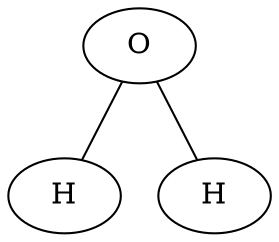
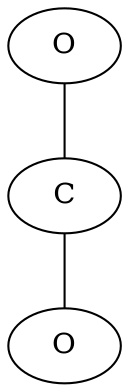

# lewis
루이스 전자점 구조를 계산

## 환경 설정 (최초 1번만 하면 됨)
- Python 최신 버전 설치하기 (버전 3.XX): https://www.python.org/downloads/windows/
- git 설치하기: https://git-scm.com/download/win
- 적당한 위치로 디렉토리 이동 후, 소스코드 다운받기
  - `git clone https://github.com/strongwire2/lewis.git`
  - `cd lewis`
- Command Line에서 가상환경 만들고, 활성화 
  - `python -m venv venv`
  - `venv\Scripts\activate`
- PyCharm에서 가상환경 만들고, 활성화
  - https://www.jetbrains.com/ko-kr/pycharm/download/?section=windows#   ==> Community 버전 다운받을 것 
  - 파일 -> 설정 -> 프로젝트 -> Python 인터프리터 -> 인터프리터 추가 -> 로컬 인터프리터 추가 -> 새 인터프리터 
- 필요한 라이브러리 모두 설치하기 (왼쪽 아래의 >_ 모양 아이콘 클릭하면 커맨드 창이 뜸. (.venv) 모양 확인할 것) 
  - `pip install -r requirements.txt`

## 사용한 라이브러리
- mendeleev: 원자들의 상세 정보 데이터베이스 ==> 자체적으로 해결?
- networkx: 그래프 구조를 표현
- pydot: 그래프구조를 text로 표현하기 위한 DOT 라이브러리 

## DOT 표기를 그림으로 보기 
- https://dreampuf.github.io/GraphvizOnline 

## github에 올리기
- 소스 코드 수정 후, 상단 main 선택 후 Commit(커밋) 선택 하고 커밋 메시지 기록 ==> "커밋 및 푸시" 버튼 클릭하여 Github로 올리기  

## 단일 결합
- 단일 결합 (edge bond=1)은 전자 2개가 있는 것임.
- lone_e (비공유 전자) + edge bond*2 => Octet Rule 만족하는지 보면 됨. 
- O_0 의 경우 lone_e=4, edge는 2개 (2*2=4) ==> 8개 
- H_0 의 경우 lone_e=0, edge는 1개 (1*2=2) ==> 2개 
- H_1 의 경우 lone_e=0, edge는 1개 (1*2=2) ==> 2개

# 이중 결합
- 단일 결합으로만 처리하면 아래와 같이 O_0 = 5+1*2 = 7, C_0 = 2+2*2 = 6 밖에 안됨. 

- 이중 결합으로 처리하면 Octet Rule 만족

## 강화학습 환경 
- OpenAI gymnasium 사용 
- swig 설치 필요
  - https://sourceforge.net/projects/swig/  에서 Download 버튼 눌러 `swigwin-4.3.1.zip` 파일 다운받기
  - `swigwin-4.3.1.zip` 압축 풀기 
  - 해당 디렉토리 기록. 예를 들어 c:\Users\user\Downloads\swigwin-4.3.1
  - 윈도우 버튼 -> 환경 입력 -> 시스템 환경 변수 편집 선택 -> 환경 변수... 버튼 클릭 -> 윗쪽 네모에서 Path 선택 -> 편집... 클릭 -> 제일 아래에 아까 기록한 swigwin 디렉토리 입력 -> 확인 버튼 클릭
  - 이후 PyCharm 죽이고, 새로 띄우기 
  - PyCharm 터미널에서 (venv) 나오는지 확인하고, swig 쳤을때 에러 안나는지 확인 
  - 이후 `pip install -r requirements.txt` 실행 