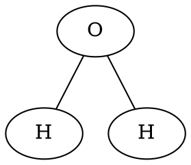

# lewis
루이스 전자점 구조를 계산

## 환경 설정 
- Python 최신 버전 설치하기 (버전 3.XX): https://www.python.org/downloads/windows/
- git 설치하기: https://git-scm.com/download/win
- 적당한 위치로 디렉토리 이동 후, 소스코드 다운받기
  - `git clone https://github.com/strongwire2/lewis.git`
  - `cd lewis`
- Command Line에서 가상환경 만들고, 활성화 
  - `python -m venv venv`
  - `venv\Scripts\activate`
- PyCharm에서 가상환경 만들고, 활성화
  - https://www.jetbrains.com/ko-kr/pycharm/download/?section=windows#   ==> Community 버전 다운받을 것 
  - 파일 -> 설정 -> 프로젝트 -> Python 인터프리터 -> 인터프리터 추가 -> 로컬 인터프리터 추가 -> 새 인터프리터 
- 필요한 라이브러리 설치하기 
  - `pip install -r requirements.txt`

## 사용한 라이브러리
- mendeleev: 원자들의 상세 정보 데이터베이스 ==> 자체적으로 해결?
- networkx: 그래프 구조를 표현
- pydot: 그래프구조를 text로 표현하기 위한 DOT 라이브러리 

## DOT 표기를 그림으로 보기 
- https://dreampuf.github.io/GraphvizOnline 

- github에 올리기
